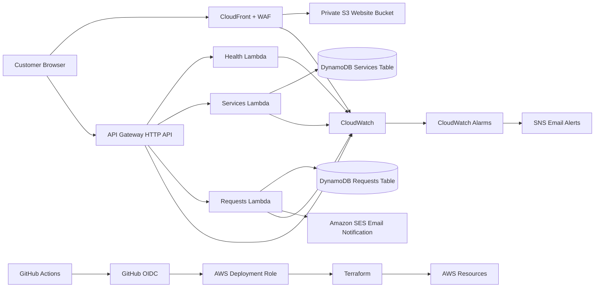

# Gure Ltd AWS Production Website

This repository contains a production-style AWS web application for Gure Ltd, a construction, vehicle hire, materials and logistics business.

The application is built as a serverless website: the frontend is hosted privately in S3 and delivered through CloudFront, while API Gateway, Lambda, DynamoDB and SES power the active request workflow.

Current live website:

```text
https://d1y23ltbnxx3ux.cloudfront.net/
```

Current API endpoint:

```text
https://py8svlymx1.execute-api.eu-central-1.amazonaws.com
```

The custom domain is not currently configured. Route 53 and ACM are optional future additions after a domain is purchased.

---

## 1. Project Goal

The goal is to build a secure, reliable and cost-effective production-style website for Gure Ltd.

Customers can use the website to view services, check service availability and submit quote, booking or enquiry requests. Submitted requests are validated by the backend, stored in DynamoDB and emailed to the business through Amazon SES.

The project is also designed to demonstrate a practical DevOps workflow using Terraform, GitHub Actions, AWS OIDC, remote state, monitoring and controlled production deployment.

Confirmed project decisions:

| Item | Value |
|---|---|
| AWS account | `232913809627` |
| AWS region | `eu-central-1` |
| Environment | `prod` |
| Business email | `a4hmed11@gmail.com` |
| GitHub repository | `triplea105/gure-ltd-aws-production-website` |
| Current website URL | `https://d1y23ltbnxx3ux.cloudfront.net/` |
| Current API URL | `https://py8svlymx1.execute-api.eu-central-1.amazonaws.com` |
| Custom domain | Not configured yet |

---

## 2. Architecture Diagram



Traffic flow:

```text
Customer
  -> CloudFront
  -> Private S3 frontend
  -> API Gateway
  -> Lambda
  -> DynamoDB
  -> SES email notification
```

Deployment flow:

```text
Developer
  -> Pull request
  -> GitHub Actions checks
  -> Merge to main
  -> GitHub OIDC assumes AWS deployment role
  -> Terraform plan and apply
  -> AWS production resources updated
```

---

## 3. Technologies Used

| Area | Technology | Purpose |
|---|---|---|
| Frontend | HTML, CSS, JavaScript | Website pages, service display and request forms |
| Hosting | Amazon S3 | Private frontend asset storage |
| CDN | Amazon CloudFront | Public HTTPS delivery and caching |
| Security | AWS WAF, IAM, OAC | Traffic protection and private S3 access |
| API | Amazon API Gateway HTTP API | Public backend routes |
| Compute | AWS Lambda with Python 3.12 | Backend business logic |
| Database | Amazon DynamoDB | Service availability and customer request storage |
| Email | Amazon SES | Business request notifications |
| Alerts | Amazon SNS | Operational email alerts |
| Observability | Amazon CloudWatch | Logs, metrics, dashboard and alarms |
| Infrastructure | Terraform | Application infrastructure as code |
| Bootstrap | CloudFormation | Terraform state bucket, lock table and GitHub deploy role |
| CI/CD | GitHub Actions, GitHub OIDC | Automated validation and deployment |
| Testing | Python unittest, Terraform validate | Local and pull-request quality checks |

---

## 4. DevOps Lifecycle

The project follows a simple production-style DevOps lifecycle.

```text
Plan the change
  -> Edit application or Terraform code
  -> Run local quality checks
  -> Open a pull request
  -> Run GitHub Actions validation
  -> Review and merge into main
  -> Deploy with GitHub Actions
  -> Verify the live website and API
  -> Monitor logs, metrics and alerts
```

Terraform is the source of truth for AWS application infrastructure. Manual console changes should be avoided unless they are part of a clearly understood recovery step.

The Terraform backend is created separately with CloudFormation because Terraform needs its remote state bucket and lock table before it can safely manage the application infrastructure.

The GitHub Actions deployment uses OIDC instead of long-lived AWS access keys. GitHub receives temporary AWS credentials by assuming this role:

```text
arn:aws:iam::232913809627:role/gure-ltd-github-deploy
```

---

## 5. Resource Breakdown

| Resource | Name or Details | Purpose |
|---|---|---|
| Terraform backend stack | `gure-ltd-terraform-backend` | Creates backend state resources and GitHub deploy role |
| Terraform state bucket | `gure-ltd-terraform-state-232913809627` | Stores remote Terraform state |
| Terraform lock table | `gure-ltd-terraform-locks` | Prevents concurrent Terraform writes |
| Website bucket | `gure-ltd-prod-website-232913809627` | Stores frontend files privately |
| CloudFront distribution | `E1AQVMO70BTTKD` | Serves the website publicly |
| CloudFront domain | `d1y23ltbnxx3ux.cloudfront.net` | Current browser URL |
| API Gateway | `gure-ltd-prod-api` | Exposes `/health`, `/services` and `/requests` |
| Health Lambda | `gure-ltd-prod-health` | Returns API health status |
| Services Lambda | `gure-ltd-prod-services` | Returns service availability data |
| Requests Lambda | `gure-ltd-prod-requests` | Validates and stores customer requests |
| Services table | `gure-ltd-prod-services` | Stores service records |
| Requests table | `gure-ltd-prod-requests` | Stores customer requests |
| SES identity | `a4hmed11@gmail.com` | Sends request notification emails |
| SNS topic | `gure-ltd-prod-alerts` | Sends operational alerts |
| CloudWatch dashboard | `gure-ltd-prod-operations` | Shows operational metrics |
| WAF | `gure-ltd-prod-cloudfront-waf` | Adds managed protections and rate limiting |

The custom domain resources are optional. Route 53 and ACM stay disabled until a real domain is purchased and ready to attach.

---

## 6. Build Steps

The project was built in layers so each part could be tested before moving on.

First, the project decisions were confirmed: AWS account, AWS region, environment name, email address and GitHub repository.

Next, the Terraform backend was bootstrapped using CloudFormation. This created the remote state S3 bucket, DynamoDB lock table and GitHub Actions deployment role.

After that, local quality checks were added and verified. The backend compiles, unit tests pass, Terraform formatting passes and Terraform validation passes.

Then the frontend hosting layer was deployed using a private S3 bucket, CloudFront, Origin Access Control and WAF.

The backend foundation followed with Lambda execution roles, a health Lambda and an API Gateway `/health` route.

Service availability was added with a DynamoDB services table, seed records and `/services` API routes.

Customer requests were added with a DynamoDB requests table, validation, `POST /requests` and frontend form integration.

Email notifications were then connected with SES. The system was tested to make sure requests remain saved even if SES email sending fails.

Monitoring was added with CloudWatch logs, alarms, dashboard and SNS email alerts.

Finally, GitHub Actions deployment was configured using OIDC and the production deployment role.

Useful local commands:

```bash
python3 -m compileall backend
python3 -m unittest discover
terraform fmt -check -recursive
cd terraform/environments/prod
terraform init -backend=false -input=false
terraform validate
```

---

## 7. Deployment Method

Production deployment is handled by GitHub Actions and Terraform.

Pull requests run the validation workflow:

```text
.github/workflows/pull-request.yml
```

The pull-request workflow checks Python compilation, backend tests, Terraform formatting and Terraform validation.

Deployments run from:

```text
.github/workflows/deploy.yml
```

The deployment workflow runs when changes are merged into `main`. It assumes the AWS deployment role through GitHub OIDC, initializes Terraform with the remote backend, validates the configuration, creates a Terraform plan and applies it.

The GitHub repository should have a `production` environment with this secret:

```text
AWS_ROLE_TO_ASSUME=arn:aws:iam::232913809627:role/gure-ltd-github-deploy
```

The GitHub `main` branch should be protected with pull-request review and required checks. The `production` environment can also require manual approval before Terraform apply.

Important deployment fixes already implemented:

The GitHub deployment role needed extra permissions because Terraform reads resource settings during create, update and delete operations. The CloudFormation bootstrap template was updated to include permissions such as `iam:ListAttachedRolePolicies`, `iam:ListInstanceProfilesForRole`, `s3:Get*`, `s3:ListBucketVersions`, `s3:PutEncryptionConfiguration` and `s3:DeleteObjectVersion`.

The frontend API config is generated by Terraform so the browser always points to the current API Gateway endpoint. This prevents the website from using an old destroyed API URL after infrastructure is recreated.

---

## 8. Testing and Verification

Local checks:

```text
Python compile check: passed
Backend unit tests: passed
Terraform fmt check: passed
Terraform validation: passed
```

Live checks completed:

```text
Website loads through CloudFront
/health returns HTTP 200
/services returns 9 services
/services/logistics returns 3 services
/services/vehicle_hire returns 3 services
/services/hardware_materials returns 3 services
Invalid request payloads return HTTP 400
Valid request payloads return HTTP 201
Requests are saved in DynamoDB
SES email notification sends successfully
API Gateway logs show successful requests
Lambda logs show successful invocations
SNS alert email delivery works
Failure alarm path was tested
Terraform plan returned no drift after fixes
```

A request form issue was found after redeployment. The website was still loading an old `assets/js/config.js` file that pointed to a destroyed API endpoint. Terraform was updated to generate that config from the live API Gateway endpoint, the file was replaced in S3 and CloudFront was invalidated.

Current browser config now points to:

```text
https://py8svlymx1.execute-api.eu-central-1.amazonaws.com
```

---

## 9. Monitoring and Logging

The application uses CloudWatch for logs, metrics, alarms and dashboards.

Configured log groups:

```text
/aws/lambda/gure-ltd-prod-health
/aws/lambda/gure-ltd-prod-services
/aws/lambda/gure-ltd-prod-requests
/aws/apigateway/gure-ltd-prod-api
```

Log retention is set to 30 days.

Monitoring includes:

```text
Lambda errors
Lambda throttles
API Gateway 5xx errors
API Gateway latency
DynamoDB throttles
DynamoDB system errors
SES notification failures
```

Operational dashboard:

```text
gure-ltd-prod-operations
```

SNS alert topic:

```text
gure-ltd-prod-alerts
```

Alert email:

```text
a4hmed11@gmail.com
```

The monitoring setup was tested by sending an SNS test alert and manually moving a CloudWatch alarm from `OK` to `ALARM` and back to `OK`.
