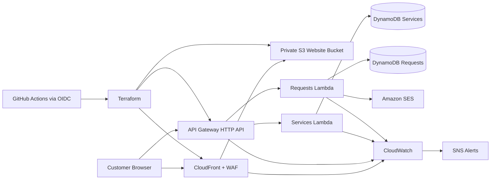

# Gure Ltd AWS Production Website

## Project Overview

This project builds a secure, scalable, reliable and cost-effective active business website for **Gure Ltd**, a construction and logistics company operating in Kenya.

Gure Ltd provides construction materials, construction vehicle hire, hardware/material supplies, and logistics services such as cooking oil delivery, fuel transport, container movement and commercial goods delivery.

The aim of this project is to create a professional company website that also works as a live service request platform. Customers should be able to view the company’s services, check what is available, and submit booking or quote requests through an active backend.

This project is designed to give realistic DevOps and cloud engineering experience, similar to previous ECS, EKS and Lambda projects, while still using the most suitable architecture for this type of business website.

---

## Core Project Structure

This README is organised around the nine areas required to build, deploy and operate the application:

1. [Project Goal](#1-project-goal)
2. [Architecture Diagram](#2-architecture-diagram)
3. [Technologies Used](#3-technologies-used)
4. [DevOps Lifecycle](#4-devops-lifecycle)
5. [Resource Breakdown](#5-resource-breakdown)
6. [Build Steps](#6-build-steps)
7. [Deployment Method](#7-deployment-method)
8. [Testing and Verification](#8-testing-and-verification)
9. [Monitoring and Logging](#9-monitoring-and-logging)

The remaining sections provide the detailed business, application, security and infrastructure specifications.

---

## 1. Project Goal

Build a fully functioning, production-style AWS web application for Gure Ltd. The application presents the company's construction and logistics services and allows customers to check availability and submit quote, booking and general enquiry requests.

### Confirmed Project Decisions

| Decision | Value |
|---|---|
| AWS region | `eu-central-1` |
| Live website URL | `https://d1xwqnyfl2cknk.cloudfront.net/` |
| Custom domain | Not configured yet; add later after a domain is purchased |
| Environment | `prod` |
| Business notification email | `a4hmed11@gmail.com` |
| GitHub repository | `triplea105/gure-ltd-aws-production-website` |

The completed application must be:

- Cost-effective and scalable
- Secure, reliable and fault tolerant
- Monitored and supportable after deployment
- Reproducible through Terraform
- Automatically validated and deployed through GitHub Actions

The first version uses a static frontend and serverless backend. ECS or EKS should only be introduced later if the application grows beyond the serverless design.

---

## 2. Architecture Diagram



The public website is currently served from a private S3 bucket through the CloudFront distribution URL. API Gateway invokes Lambda functions for service availability and customer requests. DynamoDB stores application data, SES sends business notifications, and CloudWatch/SNS provide operational visibility and alerts. Route 53 and a custom domain can be added later after a real domain is purchased.

---

## 3. Technologies Used

| Area | Technology | Use |
|---|---|---|
| Frontend | HTML, CSS, JavaScript | Responsive pages, service display and request forms |
| Backend | Python, AWS Lambda | Validation, business logic and integrations |
| API | Amazon API Gateway | Public `/health`, `/services` and `/requests` endpoints |
| Storage | Amazon DynamoDB | Customer requests and service availability |
| Web hosting | Amazon S3, CloudFront | Private origin and global content delivery |
| Domain/security | CloudFront HTTPS, WAF, IAM | HTTPS, traffic protection and access control |
| Notifications | Amazon SES, SNS | Customer-request emails and operational alerts |
| Observability | Amazon CloudWatch | Logs, metrics, dashboards and alarms |
| Infrastructure | Terraform, CloudFormation | Repeatable infrastructure and state bootstrap |
| CI/CD | GitHub Actions, AWS OIDC | Validation and production deployment |
| Testing | Python `unittest`, Terraform validation | Backend and infrastructure checks |

---

## 4. DevOps Lifecycle

```text
Plan
  -> Develop frontend, backend and Terraform
  -> Validate locally
  -> Open pull request
  -> Run automated tests and Terraform checks
  -> Review and merge to main
  -> Assume AWS deployment role through GitHub OIDC
  -> Terraform plan and apply
  -> Verify the live application
  -> Monitor logs, metrics and alerts
  -> Improve through the next change
```

Every infrastructure change is defined as code. Pull requests are the quality gate, the protected production environment is the deployment gate, and monitoring feeds operational findings into the next development cycle.

---

## 5. Resource Breakdown

| Resource | Responsibility |
|---|---|
| S3 website bucket | Stores frontend files without public bucket access |
| CloudFront distribution and OAC | Delivers the site and securely reads from S3 |
| WAF web ACL | Applies managed protections and rate limiting |
| Route 53 hosted zone | Optional future custom-domain DNS after a domain is purchased |
| ACM certificate | Optional future HTTPS certificate for a purchased custom domain |
| API Gateway HTTP API | Exposes backend routes with controlled CORS |
| Services Lambda | Returns health and service availability data |
| Requests Lambda | Validates and processes customer requests |
| Requests DynamoDB table | Stores enquiries, quotes and bookings |
| Services DynamoDB table | Stores service descriptions and availability |
| SES identity | Sends request notifications to Gure Ltd |
| CloudWatch log groups/dashboard | Centralises logs and operational metrics |
| CloudWatch alarms and SNS topic | Notify operators of application failures |
| IAM roles and policies | Grant least-privilege runtime and deployment access |
| Terraform state S3 bucket | Stores production infrastructure state |
| Terraform lock table | Prevents concurrent state changes |
| GitHub Actions workflows | Test, plan and deploy application changes |

---

## 6. Build Steps

1. Configure the AWS account, region, domain and notification email values.
2. Deploy the one-time CloudFormation bootstrap stack for Terraform state and locking.
3. Initialise Terraform in `terraform/environments/prod`.
4. Build and validate the frontend files under `website/`.
5. Compile and test the Python handlers under `backend/`.
6. Run `terraform fmt`, `terraform validate` and `terraform plan`.
7. Review the plan before creating AWS resources.
8. Deploy the infrastructure and application through the approved CI/CD workflow.
9. Complete the live verification checklist and subscribe to operational alerts.

Detailed commands are provided under [Bootstrap Commands](#bootstrap-commands) and [Terraform Commands](#terraform-commands).

---

## 7. Deployment Method

Production deployment uses GitHub Actions and Terraform:

1. A developer opens a pull request.
2. `.github/workflows/pull-request.yml` compiles Python, runs unit tests, checks Terraform formatting and validates Terraform.
3. After review, the change is merged into `main`.
4. `.github/workflows/deploy.yml` assumes an AWS IAM role through GitHub OIDC.
5. The workflow runs `terraform init`, `validate`, `plan` and `apply`.
6. Terraform packages Lambda code, provisions AWS resources, uploads the website and writes the deployed API URL into the frontend configuration.
7. A protected GitHub production environment should require approval before `terraform apply`.

Manual console changes should be avoided because Terraform is the source of truth for production infrastructure.

---

## 8. Testing and Verification

Automated checks must cover:

- Python compilation and backend unit tests
- Valid and invalid request payloads
- DynamoDB and SES integration boundaries
- Service filtering and availability responses
- Terraform formatting and validation
- Infrastructure plan review

Post-deployment verification must confirm:

- The website and HTTPS endpoint load successfully
- `/health`, `/services` and `/requests` behave correctly
- CORS accepts only approved origins
- Valid requests reach DynamoDB
- SES notifications reach the configured business address
- CloudWatch logs do not expose sensitive customer data
- WAF, alarms and SNS notifications are active

The complete acceptance checks are listed under [Manual Validation Checklist](#manual-validation-checklist).

---

## 9. Monitoring and Logging

CloudWatch provides centralised logs, metrics, dashboards and alarms for CloudFront, API Gateway, Lambda and DynamoDB. SNS emails operational alerts to the responsible engineer or business contact.

The operating baseline includes:

- Structured Lambda logs with request identifiers
- No full customer payloads or unnecessary personal information in logs
- Lambda error, duration and throttle metrics
- API Gateway 4xx, 5xx and latency metrics
- DynamoDB error and throttle metrics
- CloudFront and WAF request metrics
- Alarms for backend errors, API failures and notification failures
- Log retention periods appropriate to business and privacy requirements

Detailed thresholds and alert behaviour are defined under [Monitoring and Application Health](#monitoring-and-application-health) and [Alerts](#alerts).

---

## Detailed Business Requirements

The website must allow customers to:

- Learn about Gure Ltd
- View construction and logistics services
- Browse available service categories
- Request logistics services
- Request construction vehicle hire
- Request construction materials or hardware items
- Submit quote or booking requests
- Contact the company directly

The business should be able to:

- Receive customer enquiries
- Store booking and quote requests
- Access submitted customer data
- Check service request history
- Monitor application health
- Receive alerts when failures occur
- Troubleshoot issues using logs and metrics

---

## Website Pages

The website will include the following pages:

| Page | Purpose |
|---|---|
| Home | Presents the company, main services, trust points, projects and quote form |
| About | Explains the company background, mission, values and operating areas |
| Services | Shows all service categories and available options |
| Contact | Allows users to contact the company and request a quote |

The initial navigation will be:

```text
Home
About
Services
Contact
Request a Quote
```

---

## Homepage Requirements

The homepage should have a professional construction and logistics design. It should look similar in structure to a modern construction company website, with a strong hero section, service cards, project images and a clear quote request form.

The homepage should include:

1. **Navigation bar**
   - Gure Ltd logo
   - Home
   - About
   - Services
   - Contact
   - Request a Quote button

2. **Hero section**
   - Large banner image showing construction vehicles, paving blocks and logistics trucks
   - Main heading such as:
     ```text
     Construction Materials, Equipment Hire & Logistics Solutions
     ```
   - Short company description
   - Buttons for:
     - Our Services
     - Request a Quote

3. **Trust strip**
   - Quality assured
   - Reliable delivery
   - Experienced team
   - Kenya-based operations

4. **Services overview**
   - Logistics
   - Construction Vehicle Hire
   - Hardware / Materials
   - Road Paving Blocks

5. **Why choose us**
   - Reliable service
   - Safe operations
   - Professional team
   - Construction and logistics experience

6. **Fleet and logistics preview**
   - Excavators
   - Diggers
   - Wheel loaders
   - Rollers
   - Fuel delivery
   - Cooking oil delivery
   - Container transport

7. **Projects / Gallery preview**
   - Road paving blocks
   - Construction sites
   - Heavy machinery
   - Delivery trucks
   - Containers

8. **Quote request form**
   - Full name
   - Email
   - Phone number
   - Service required
   - Location
   - Message

9. **Footer**
   - Company summary
   - Quick links
   - Services
   - Contact information

---

## Services Requirements

The Services page should group the company’s services into three main categories.

### 1. Logistics

Customers should be able to view and request logistics services.

Example logistics services:

- Fuel delivery
- Cooking oil delivery
- Container transport
- Goods or food delivery
- General commercial transport

Each logistics service should show:

- Service name
- Short description
- Availability status
- Request button
- Booking/quote form

Example availability:

```text
Fuel Delivery - Available
Cooking Oil Delivery - Available
Container Transport - Available
Goods Delivery - Available
```

### 2. Construction Vehicle Hire

Customers should be able to view available construction vehicles and submit hire requests.

Example vehicles:

- Digger
- Excavator
- Wheel loader
- Roller
- Tipper truck

Each vehicle should show:

- Vehicle name
- Description
- Availability
- Hire type
- Request button

Example availability:

```text
Excavator - Available
Wheel Loader - Available
Roller - Unavailable
Tipper Truck - Available
```

### 3. Hardware / Materials

Customers should be able to request construction materials and hardware items.

Example materials:

- Interlocking road paving blocks
- Construction tools
- Building materials
- Other hardware items

Each item should show:

- Item name
- Description
- Stock or availability status
- Request/order button

Example availability:

```text
Road Paving Blocks - In Stock
Construction Tools - Available
Building Materials - Available on Request
```

---

## Booking and Request Flow

The website should allow customers to submit service-specific requests.

### Example Customer Flow

```text
Customer visits website
  -> Opens Services page
  -> Selects Logistics / Vehicle Hire / Hardware
  -> Views available options
  -> Clicks Request / Book
  -> Completes form
  -> Request is sent to API Gateway
  -> Lambda processes request
  -> Request is stored in DynamoDB
  -> Email notification is sent to Gure Ltd
  -> CloudWatch logs the request
```

### Request Types

The backend should support different request types:

```text
logistics_request
vehicle_hire_request
hardware_material_request
general_enquiry
```

### Request Validation

All request submissions should be validated before they are stored or emailed.

Validation rules:

- `request_type` must match one of the supported request types
- `category` must match a known service category: `logistics`, `vehicle_hire`, `hardware_materials` or `general`
- `service_requested` is required
- `full_name` is required
- `phone_number` is required and should support Kenyan and international formats
- `email` is optional but must be valid when provided
- `location` is required
- `message` should have a maximum length to prevent oversized submissions
- Unknown fields should be ignored or rejected consistently

The frontend should show clear validation messages, but the Lambda backend must also validate every request because frontend checks can be bypassed.

---

## Application Architecture

### Public Website

```text
User / Browser
  -> CloudFront
  -> Private S3 Bucket
```

### Request Backend

```text
Website Request Form
  -> API Gateway
  -> Lambda request validation
  -> Lambda
  -> DynamoDB
  -> SES Email Notification
```

### Monitoring and Alerts

```text
CloudWatch Logs / Metrics
  -> CloudWatch Alarms
  -> SNS Topic
  -> Email Alert
```

### Fully Active Website Target

The final website is intended to be fully active, not only a brochure site.

Target active workflow:

```text
Customer opens website
  -> Views live service categories and availability
  -> Submits quote, booking or enquiry form
  -> API Gateway receives the request
  -> Lambda validates and processes the request
  -> DynamoDB stores the request and service data
  -> SES sends the business an email notification
  -> CloudWatch logs and alarms monitor the workflow
```

The frontend is delivered from S3 and CloudFront, but customer requests, service availability, notifications, storage, monitoring and future admin features are handled through active AWS backend services.

---

## Why This Architecture Is Suitable

This project uses a frontend delivered through S3 and CloudFront with an active serverless backend because that is the most suitable and cost-effective design for this type of business application.

The frontend assets do not need a continuously running web server. They can be stored in S3 and delivered through CloudFront, while active workflows such as bookings, quote requests, service availability and notifications are handled using API Gateway, Lambda, DynamoDB and SES.

This design is cheaper and simpler than ECS or EKS while still being scalable, secure and production-ready.

---

## AWS Services Used

| AWS Service | Purpose |
|---|---|
| Amazon S3 | Stores frontend website assets |
| Amazon CloudFront | Delivers the website securely and improves performance |
| Amazon Route 53 | Optional future DNS for a purchased custom domain |
| AWS Certificate Manager | Optional future certificate for a purchased custom domain |
| AWS WAF | Protects the website from unwanted or suspicious traffic |
| API Gateway | Provides public API endpoints for requests |
| AWS Lambda | Runs Python backend logic |
| Amazon DynamoDB | Stores enquiries, bookings and service requests |
| Amazon SES | Sends email notifications to the business |
| Amazon SNS | Sends monitoring alerts |
| Amazon CloudWatch | Logs, metrics, dashboards and alarms |
| IAM | Controls service permissions |
| Terraform | Provisions AWS infrastructure |
| GitHub Actions | Automates validation and deployment |

---

## API Security and CORS

API Gateway should allow requests only from the approved website domain.

Recommended CORS settings:

```text
Allowed origins: https://<website-domain>
Allowed methods: GET, POST, OPTIONS
Allowed headers: Content-Type
```

For development, a localhost origin can be allowed separately, but production should not use a wildcard origin.

Public request endpoints should also include basic abuse protection:

- AWS WAF rate-based rules
- API Gateway throttling
- Request body size limits
- Backend validation before DynamoDB writes
- Optional honeypot field on public forms
- CAPTCHA later if spam becomes a real issue

---

## Application Code

The application will be split into frontend and backend code.

Current code build status:

```text
Frontend website pages: created
Backend health Lambda code: created
Backend request validation: created
Backend request handler skeleton: created
Backend services handler: created
Backend DynamoDB utility boundary: created
Backend SES notification boundary: created
Backend unit tests: created
GitHub Actions pull request pipeline: created
GitHub Actions deploy plan pipeline: created
Terraform active website infrastructure: created
Frontend API integration: created
```

### Frontend

The frontend will be responsible for the website layout and user interaction.

Recommended technologies:

```text
HTML
CSS
JavaScript
```

or later:

```text
React
```

The frontend will include:

- Home page
- About page
- Services page
- Contact page
- Service cards
- Availability display
- Booking/request forms

The first frontend step creates:

```text
website/index.html
website/about.html
website/services.html
website/contact.html
website/assets/css/styles.css
website/assets/js/config.js
website/assets/js/main.js
website/assets/images/
```

This gives the project working frontend pages for the active website. Terraform generates the deployed `assets/js/config.js` file with the API Gateway endpoint so the quote form can submit requests after deployment.

### Backend

The backend will be written in **Python** and deployed as AWS Lambda functions.

The backend will handle:

- Health checks
- Returning available services
- Processing quote requests
- Processing logistics requests
- Processing vehicle hire requests
- Processing hardware/material requests
- Writing request data to DynamoDB
- Sending email notifications through SES
- Logging activity to CloudWatch

The first backend step creates:

```text
backend/handlers/health.py
backend/handlers/notifications.py
backend/handlers/requests.py
backend/handlers/services.py
backend/utils/dynamodb.py
backend/utils/notifications.py
backend/utils/responses.py
backend/utils/services_data.py
backend/utils/validation.py
backend/requirements.txt
```

The health handler returns a simple JSON response and will later be connected to the `/health` API Gateway endpoint. The services handler returns seed service availability data until DynamoDB service storage is added. The request handler parses future API Gateway request bodies, validates customer payloads, builds a request item, and calls the DynamoDB and SES utility boundaries. Actual DynamoDB writes and SES email sends stay disabled until infrastructure, environment variables and IAM permissions are created.

For the first version, the backend can be split into two Lambda functions:

- `services` Lambda for `/health` and `/services`
- `requests` Lambda for `/requests`

This keeps the application simple while separating read-only service endpoints from customer request processing.

---

## Suggested Repository Structure

```text
.
├── website/
│   ├── index.html
│   ├── about.html
│   ├── services.html
│   ├── contact.html
│   └── assets/
│       ├── css/
│       │   └── styles.css
│       ├── js/
│       │   └── main.js
│       └── images/
├── backend/
│   ├── handlers/
│   │   ├── __init__.py
│   │   ├── health.py
│   │   ├── services.py
│   │   ├── requests.py
│   │   └── notifications.py
│   ├── utils/
│   │   ├── __init__.py
│   │   ├── dynamodb.py
│   │   ├── responses.py
│   │   └── validation.py
│   └── requirements.txt
├── terraform/
│   ├── bootstrap/
│   │   ├── cloudformation-bootstrap.yaml
│   │   └── README.md
│   ├── environments/
│   │   └── prod/
│   │       ├── main.tf
│   │       ├── variables.tf
│   │       ├── outputs.tf
│   │       ├── provider.tf
│   │       └── backend.tf
│   └── modules/
│       ├── s3/
│       ├── cloudfront/
│       ├── route53/
│       ├── acm/
│       ├── waf/
│       ├── api-gateway/
│       ├── lambda/
│       ├── dynamodb/
│       ├── ses/
│       ├── sns/
│       ├── cloudwatch/
│       └── iam/
├── .github/
│   └── workflows/
│       ├── pull-request.yml
│       └── deploy.yml
└── README.md
```

---

## DynamoDB Data Design

The backend will store customer requests in DynamoDB.

### Table: `gure-ltd-requests`

Suggested key design:

```text
Partition key: request_id
```

Recommended attributes:

```text
request_id
request_type
category
service_requested
full_name
phone_number
email
location
message
status
created_at
updated_at
source_ip_hash
user_agent
```

Recommended indexes:

```text
GSI 1: request_type-created_at-index
  Partition key: request_type
  Sort key: created_at

GSI 2: status-created_at-index
  Partition key: status
  Sort key: created_at
```

These indexes make it easier to check request history by type or status without scanning the full table.

Example item:

```json
{
  "request_id": "req-001",
  "request_type": "vehicle_hire_request",
  "category": "vehicle_hire",
  "service_requested": "Excavator",
  "full_name": "Customer Name",
  "phone_number": "+254700000000",
  "email": "customer@example.com",
  "location": "Nairobi, Kenya",
  "message": "I need an excavator for three days.",
  "status": "new",
  "created_at": "2026-06-08T10:00:00Z",
  "updated_at": "2026-06-08T10:00:00Z"
}
```

### Table: `gure-ltd-services`

This table can store service availability.

Suggested key design:

```text
Partition key: service_id
```

Example item:

```json
{
  "service_id": "excavator-hire",
  "category": "vehicle_hire",
  "name": "Excavator",
  "description": "Heavy machinery for digging, trenching and earthmoving.",
  "availability": "available",
  "request_type": "vehicle_hire_request"
}
```

---

## Data Access

The business or engineer should be able to check application data after deployment.

### AWS Console

```text
DynamoDB
  -> Tables
  -> gure-ltd-requests
  -> Explore table items
```

### AWS CLI

```bash
aws dynamodb scan   --table-name gure-ltd-requests   --region <aws-region>
```

### Data Checks

After submitting a test request, confirm:

- A new request appears in DynamoDB
- Request type is correct
- Customer details are stored
- Service requested is stored
- Status is set to `new`
- Created timestamp is recorded

---

## API Endpoints

Suggested API endpoints:

| Method | Endpoint | Purpose |
|---|---|---|
| GET | `/health` | Checks backend health |
| GET | `/services` | Lists all available services |
| GET | `/services/{category}` | Lists services by category |
| POST | `/requests` | Creates a new customer request |

### Health Check Response

```json
{
  "status": "ok",
  "service": "gure-ltd-api"
}
```

### Create Request Example

```bash
curl -X POST https://<api-url>/requests   -H "Content-Type: application/json"   -d '{
    "request_type": "logistics_request",
    "category": "logistics",
    "service_requested": "Cooking Oil Delivery",
    "full_name": "Customer Name",
    "phone_number": "+254700000000",
    "email": "customer@example.com",
    "location": "Mombasa, Kenya",
    "message": "I need cooking oil delivered to my business."
  }'
```

### API Error Responses

The API should return consistent JSON error responses.

Example validation error:

```json
{
  "error": "validation_error",
  "message": "phone_number is required"
}
```

Recommended status codes:

| Status Code | Purpose |
|---|---|
| 200 | Successful health or service request |
| 201 | Customer request created |
| 400 | Invalid request data |
| 403 | Origin or WAF blocked request |
| 404 | Endpoint not found |
| 429 | Too many requests |
| 500 | Unexpected backend failure |

---

## Email Notifications

SES will send customer request notifications to the business email address.

SES setup requirements:

- Verify the sender email or domain
- Move SES out of sandbox before production use
- Store destination email addresses in Lambda environment variables
- Log SES failures without logging sensitive customer message content
- Alarm on repeated SES send failures

The customer request should still be saved to DynamoDB even if the email notification fails. This prevents lost enquiries during temporary email issues.

---

## Monitoring and Application Health

CloudWatch will be used to monitor application health.

### Components to Monitor

| Component | Metrics |
|---|---|
| CloudFront | Requests, 4XX errors, 5XX errors |
| API Gateway | Request count, latency, 4XX errors, 5XX errors |
| Lambda | Invocations, errors, duration, throttles |
| DynamoDB | Successful requests, throttled requests, system errors |
| SES | Email send failures |
| WAF | Blocked requests |

### CloudWatch Dashboard

A dashboard should be created to show:

- CloudFront request count
- CloudFront errors
- API Gateway latency
- API Gateway 4XX/5XX errors
- Lambda invocations
- Lambda errors
- Lambda duration
- Lambda throttles
- DynamoDB throttled requests
- SES email failures
- WAF blocked requests

---

## Alerts

CloudWatch alarms should send alerts through SNS.

### Alert Flow

```text
CloudWatch Alarm
  -> SNS Topic
  -> Email Notification
```

### Recommended Alarms

| Alarm | Reason |
|---|---|
| Lambda errors > 0 | Detects failed backend executions |
| Lambda throttles > 0 | Detects concurrency or scaling issues |
| Lambda duration too high | Detects slow processing |
| API Gateway 5XX errors > 0 | Detects backend failures |
| API Gateway 4XX errors above threshold | Detects repeated bad requests |
| DynamoDB throttled requests > 0 | Detects database capacity issues |
| SES send failures > 0 | Detects email notification problems |
| CloudFront 5XX errors above threshold | Detects website delivery issues |
| WAF blocked request spike | Detects suspicious traffic |

---

## Cost-Effective Design

This architecture is cost-effective because the website does not need always-running servers.

Cost-saving choices:

- Frontend assets hosted in S3
- CloudFront caching
- Lambda runs only when requests are made
- DynamoDB on-demand billing
- No ECS service required initially
- No EKS cluster required initially
- CloudWatch log retention configured
- S3 lifecycle rules for old assets
- Terraform prevents duplicate manual resources

---

## Scalability

The architecture scales automatically through managed AWS services.

Scalability features:

- CloudFront handles high website traffic
- S3 stores frontend assets
- API Gateway handles API request traffic
- Lambda scales with incoming requests
- DynamoDB scales using on-demand capacity

---

## Security

Security measures:

- S3 bucket kept private
- CloudFront Origin Access Control used
- HTTPS enabled through the CloudFront distribution URL
- WAF attached to CloudFront
- API Gateway CORS restricted to approved origins
- API Gateway throttling enabled
- IAM least privilege policies
- Lambda only allowed to access required DynamoDB tables
- No secrets committed to GitHub
- GitHub Actions uses OpenID Connect where possible instead of long-lived AWS access keys
- CloudWatch logs used for troubleshooting
- Customer personal data is not written to logs unless required for debugging

---

## Data Privacy and Retention

The application stores customer names, phone numbers, emails, locations and enquiry messages. Access to this data should be limited to approved business or engineering users.

Data handling requirements:

- Do not log full request payloads in CloudWatch
- Mask or omit phone numbers and emails in application logs
- Use DynamoDB encryption at rest
- Use HTTPS for all customer submissions
- Define a retention period for old requests
- Restrict DynamoDB console and CLI access through IAM
- Avoid collecting unnecessary personal information

---

## Reliability and Fault Tolerance

The project is reliable because it uses AWS managed services rather than a single server.

Fault-tolerant features:

- Frontend pages remain available even if backend requests fail
- CloudFront caches frontend assets
- DynamoDB stores request data reliably
- CloudWatch logs failures
- CloudWatch alarms notify the engineer or business
- SES sends email notifications for requests
- API Gateway and Lambda are managed services

---

## CI/CD Pipeline

GitHub Actions will automate checks and deployment.

Deployment should use GitHub Actions OpenID Connect to assume an AWS IAM role. Long-lived AWS access keys should only be used if OIDC is not available.

### Pull Request Workflow

Runs on pull requests:

```text
Terraform format check
Terraform init without remote backend
Terraform validate
Backend syntax checks
Python unit tests
Lambda handler tests
```

The workflow file is:

```text
.github/workflows/pull-request.yml
```

### Deployment Workflow

Runs on merge to main after AWS OIDC is configured:

```text
1. Checkout repository
2. Configure AWS credentials
3. Run Terraform init
4. Run Terraform validate
5. Run Terraform plan
6. Run Terraform apply
7. Output website and API values
```

The workflow file is:

```text
.github/workflows/deploy.yml
```

The deployment workflow applies Terraform after the production environment approval gate. Terraform creates the infrastructure, packages Lambda code, uploads frontend assets to S3, writes the deployed API config file, and outputs the CloudFront and API values.

Current deployment automation status:

```text
GitHub OIDC provider: created in AWS
Deployment IAM role: arn:aws:iam::232913809627:role/gure-ltd-github-deploy
IAM trust scope: repo triplea105/gure-ltd-aws-production-website and GitHub environment production
Deployment workflow: .github/workflows/deploy.yml
Workflow trigger: push to main
Workflow gate: GitHub environment production
Terraform plan/apply: configured in workflow
GitHub environment secret required: AWS_ROLE_TO_ASSUME
GitHub protected environment reviewers: configure in GitHub repository settings
```

---

## Terraform State

Terraform should use remote state for production-style deployments.

Recommended state setup:

```text
S3 bucket for Terraform state
DynamoDB table for state locking
S3 bucket versioning enabled
S3 bucket encryption enabled
Restricted IAM access to state resources
```

The Terraform backend resources can be created manually once or through a separate bootstrap step.

This repository includes a CloudFormation bootstrap template at:

```text
terraform/bootstrap/cloudformation-bootstrap.yaml
```

The template creates the S3 state bucket and DynamoDB lock table before Terraform is used.

Current bootstrap status:

```text
Template created: yes
Template validated: yes
Stack deployed: yes
AWS account: 232913809627
AWS region: eu-central-1
```

The bootstrap stack is deployed and should remain in place as the foundation for Terraform-managed AWS infrastructure.

Why the bootstrap is separate:

- Terraform needs a remote state bucket before it can store state in S3
- Terraform cannot create and use its own backend in the same first run
- DynamoDB locking helps prevent two Terraform runs from changing the same infrastructure at the same time
- Keeping bootstrap separate makes the order of operations clear and repeatable

---

## Bootstrap Commands

Run the bootstrap stack once before running Terraform with the remote backend.

```bash
aws cloudformation deploy \
  --stack-name gure-ltd-terraform-backend \
  --template-file terraform/bootstrap/cloudformation-bootstrap.yaml \
  --region eu-central-1 \
  --capabilities CAPABILITY_NAMED_IAM
```

The bootstrap template uses these default backend names:

```text
S3 bucket: gure-ltd-terraform-state-232913809627
DynamoDB table: gure-ltd-terraform-locks
```

If the S3 bucket name is already taken, pass a unique bucket name using CloudFormation parameters and update `terraform/environments/prod/backend.tf` to match.

---

## Terraform Environment Structure

The production Terraform environment lives at:

```text
terraform/environments/prod/
```

The Terraform environment now defines the active website architecture: frontend asset storage, CloudFront delivery, API Gateway routes, Lambda functions, DynamoDB tables, SES-enabled request notifications, WAF protection and basic CloudWatch/SNS monitoring.

| File | Purpose |
|---|---|
| `provider.tf` | Defines Terraform and AWS provider requirements |
| `backend.tf` | Configures the S3 remote backend created by the bootstrap stack |
| `variables.tf` | Stores configurable project values such as region and environment |
| `main.tf` | Entry point where infrastructure modules will be called |
| `outputs.tf` | Exposes important values after Terraform creates resources |

Current Terraform module status:

```text
terraform/modules/s3: created
CloudFront distribution and OAC: created
S3 bucket policy for CloudFront access: created
Website asset upload: created
API Gateway HTTP API and routes: created
Lambda functions and IAM role: created
DynamoDB request and service tables: created
DynamoDB seed service records: created
SES send permissions and Lambda configuration: created
WAF managed rules: created
CloudWatch dashboard: created
CloudWatch log retention: 30 days
Lambda, API Gateway, DynamoDB and SES failure alarms: created
SNS alert topic: created
SNS email subscription: confirmed
Route 53 custom domain: disabled until a domain is purchased
ACM custom certificate: disabled until a domain is purchased
```

---

## Terraform Commands

Before using remote state, run local Terraform checks with the backend disabled.

```bash
terraform fmt -recursive
cd terraform/environments/prod
terraform init -backend=false
terraform validate
```

After the bootstrap stack is deployed, Terraform can use remote state:

```bash
terraform fmt -recursive
cd terraform/environments/prod
terraform init
terraform validate
terraform plan
terraform apply
```

Backend local checks:

```bash
python3 -m compileall backend
python3 -m unittest discover
```

---

## Manual Validation Checklist

### Website

- Website loads through the domain
- HTTPS works
- S3 bucket is private
- CloudFront distribution is enabled
- Pages and images load correctly

### Services

- Services page shows Logistics, Vehicle Hire and Hardware categories
- Services show availability
- Booking/request buttons are visible
- Request forms submit correctly

### Backend

- `/health` endpoint returns 200
- `/services` returns service data
- `/requests` accepts valid request data
- `/requests` rejects invalid request data
- API Gateway CORS allows only approved origins
- Lambda logs appear in CloudWatch

### Data

- Requests are stored in DynamoDB
- Service availability can be checked in DynamoDB
- Test request data is accurate
- Request history can be queried by request type or status
- Sensitive customer data is not exposed in logs

### Monitoring

- CloudWatch dashboard exists
- Lambda errors are monitored
- API Gateway errors are monitored
- DynamoDB throttles are monitored
- SES notification failures are monitored
- CloudWatch logs retain data for 30 days
- SNS email alerts are configured
- SNS email subscription is confirmed

### Security

- WAF is attached to CloudFront
- WAF rate limiting is configured for public endpoints
- IAM policies are least privilege
- No secrets are stored in the code
- S3 bucket is not publicly accessible
- GitHub Actions deploys through AWS OIDC and the production deployment role

---

## Future Improvements

Future improvements could include:

- Admin dashboard for viewing and updating requests
- Customer login
- Online payment integration
- Booking calendar
- Fleet management
- Logistics tracking
- File upload for delivery documents
- ECS or EKS backend if the platform grows significantly

---

## Project Summary

This project builds a production-style AWS business website for Gure Ltd. The website allows customers to view services, check availability, and submit logistics, vehicle hire and hardware/material requests.

The current live architecture uses S3, CloudFront, WAF, API Gateway, Lambda, DynamoDB, SES, SNS, CloudWatch, Terraform and GitHub Actions. Route 53 and ACM are optional future additions only after a domain is purchased.

It is designed to be cost-effective, scalable, secure, reliable and fault tolerant, while also giving practical cloud and DevOps engineering experience.
